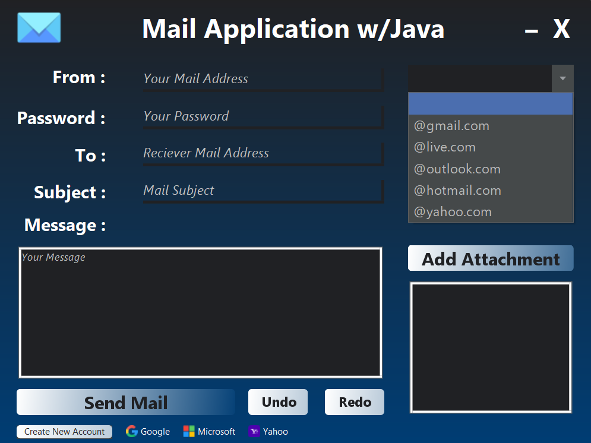
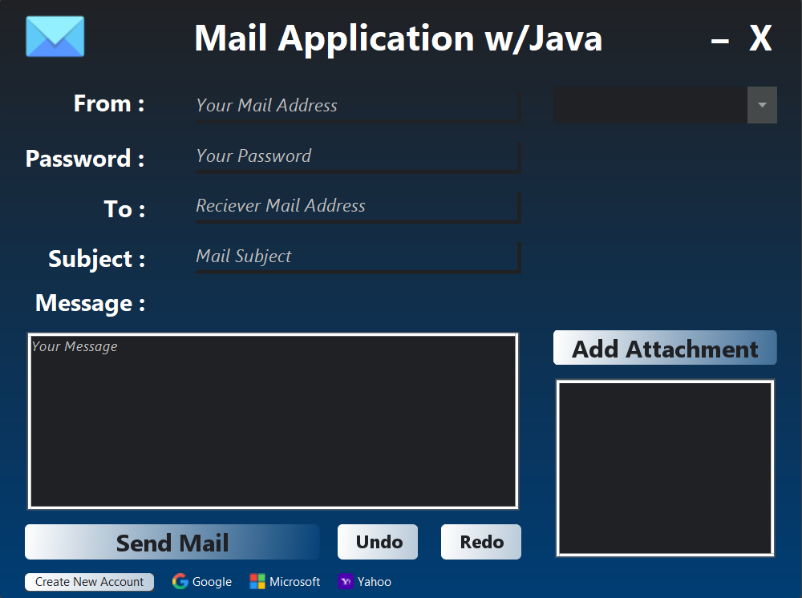
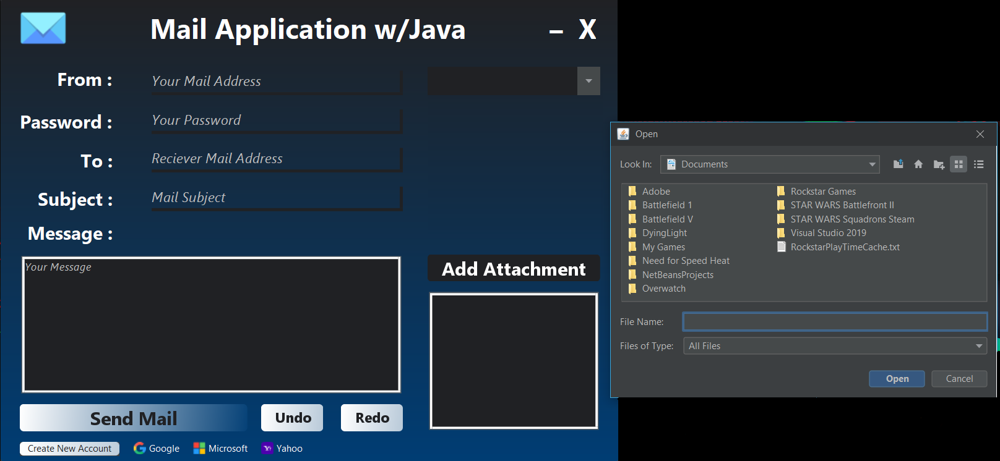

<h1>javaMail</h1>

a basic java app with gui for sending mail.

<h3>In-app image</h3>

<h3>Email provider menu</h3>

<h3>Attachment choosing screen</h3>
 

<h2>Current Roadmap:</h2>
<pre>
1.) Writing better and more understandable readme and app description.  
2.) Add some in app screenshots to readme  
3.) Add fullscreen button  
4.) Add delete attachment  
5.) Make it responsive for fullscreen  
6.) Create undo-redo button with memento pattern for message area  
7.) Create log on every successfull send mail button click  
8.) Add custom JOptionPane and it will send string where it is used and that 
sent string will be printed inside the error box
</pre>
